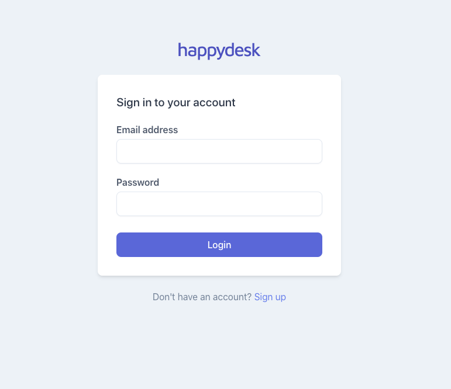

# Login Page {#login-page}

Login Page Example with Laravel Blade View Components.



### Usage

```php
// in login.blade.php

@extends('layouts.app')

@section('content')
<div class="md:max-w-md md:mx-auto px-4 min-h-screen flex flex-1 flex-col items-center">

    <div class="w-full pt-16 md:pt-24 lg:pt-32">
        
    
        <x-card class="md:p-6 lg:p-8 shadow-md">
            <h1 class="text-xl text-gray-800 font-medium mb-5">Sign in to your account</h1>
    
            <x-form method="POST" action="{{ url('login') }}">
                <x-text-input label="Email address" name="email" type="email" />
                <x-text-input label="Password" name="password" type="password" />
    
                <x-button 
                    type="submit" 
                    class="mt-2 w-full justify-center bg-indigo-600 hover:bg-indigo-700 text-white">Login</x-button>
            </x-form>
        </x-card>
    
    <p class="mt-6 text-gray-600 text-center">Don't have an account? <a href="{{ url('register') }}" class="text-indigo-500 hover:text-indigo-800">Sign up</a></p>
    </div>

    <div class="mt-auto px-4 py-8 text-sm">
        <a href="{{ url('/') }}" class="text-gray-600 hover:text-indigo-800 mr-4">&copy; Happydesk</a>
        <a href="{{ url('/') }}" class="text-gray-600 hover:text-indigo-800">Contact us</a>
    </div>
</div>
@endsection
```
