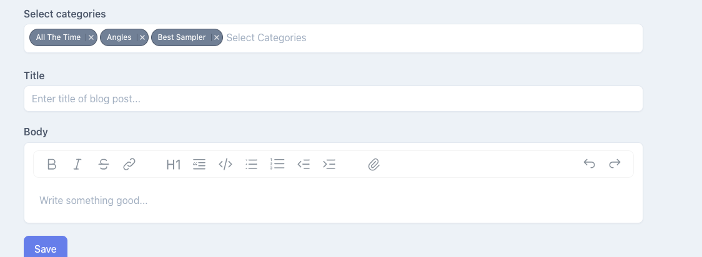

# Multiselect {#multiselect}

Simple Multiselect component powered by Blade Components and Choices.js.

[Choices.js - a lightweight, configurable select box/text input plugin.](https://joshuajohnson.co.uk/Choices/)



### Usage

Include the script and style of Choices.js.

```php
@push('styles')
<link
  rel="stylesheet"
  href="https://cdn.jsdelivr.net/npm/choices.js@9.0.1/public/assets/styles/choices.min.css"
/>
@endpush

@push('scripts')
<script src="https://cdn.jsdelivr.net/npm/choices.js@9.0.1/public/assets/scripts/choices.min.js" defer></script>
@endpush
```

Simple Usage:

```php
// in blade views

@php
	$options = [
		[
			"value" => 'All The Time',
			"label" => 'All The Time',
			"selected" => true
		],
		[
			"value" => 'Angles',
			"label" => 'Angles',
			"selected" => true
		]
	];
@endphp

<x-multiselect-choice 
	label="Select categories"
	name="category"
	:options="$options"
>
	<option value="">Select Categories</option>
</x-multiselect-choice>
```

Usage with remote data via ajax:

```php
// in blade views

<x-multiselect-choice 
	label="Select categories"
	name="category"
	remote="true"	
	endpoint="https://api.discogs.com/artists/55980/releases?token=QBRmstCkwXEvCjTclCpumbtNwvVkEzGAdELXyRyW"
>
	<option value="">Select Categories</option>
</x-multiselect-choice>
```

### Custom Style

```css
.choices,
.choices__inner,
.choices__input,
.choices__list--dropdown {
	background-color: #fff;
	border-radius: 0.5rem;
}
.choices__input {
	font-size: 1rem;
	background-color: transparent;
}
.choices__inner {
	border-color: #e2e8f0;
	box-shadow: 0 1px 2px 0 rgba(0, 0, 0, 0.05);
	display: inline-block;
    vertical-align: top;
    width: 100%;
    padding: 4.5px 7.5px 0.2px;
}
.choices.is-focused .choices__inner {
	border-radius: 0.5rem;
	box-shadow: 0 0 0 3px rgba(66, 153, 225, 0.5);
}
.choices.is-loading .choices__inner,
.choices.is-loading .choices__input {
	background-color: transparent;
}
.choices__list--dropdown {
	margin-top: 5px;
	/* padding: 5px 10px; */
}
.choices[data-type*=select-one] .choices__input {
	margin-bottom: 4px;
	background-color: #edf2f7;
	border: 0;
	border-radius: 0;
}
.choices__list--dropdown .choices__item {
	/* border-radius: 0.5rem; */
	color: inherit;
}
.is-open .choices__list--dropdown {
	z-index: 15;
	border-color:#e2e8f0;
	box-shadow: 0 1px 3px 0 rgba(0, 0, 0, 0.1), 0 1px 2px 0 rgba(0, 0, 0, 0.06);
}

.choices__list--multiple .choices__item,
.choices__list--multiple .choices__item.is-highlighted { 
	font-family: inherit;
    background-color: #718096;
    border: 1px solid #4a5568;
}
.choices[data-type*=select-multiple] .choices__button, 
.choices[data-type*=text] .choices__button {
	border-left: 1px solid #4a5568;
}
.select-has-error .choices__inner {
	border-color: #f56565;
	background-color: #fff5f5;
}
```

### Component

```php
// components/multiselect-choice.blade.php

<div class="mb-5">
	@if($label ?? null)
		<label for="{{ $name }}" class="form-label block mb-1 font-semibold text-gray-700">
			{{ $label }} 
			@if($optional ?? null)
				<span class="text-sm text-gray-500 font-normal">(optional)</span>
			@endif
		</label>
	@endif
	
	<div class="relative"
		x-ref="select-parent"
		:class="{ 'select-has-error': error.length }"
		x-data="{
			error: '',
			isRemote: Boolean('{{ $remote ?? false }}') || false,
			endpoint: '{{ $endpoint ?? '' }}',
			maxItemCount: '{{ $maxItemCount ?? -1 }}' || -1
		}"
		x-init="
			document.addEventListener('DOMContentLoaded', () => {
				choice = new Choices($refs.input, {
					searchPlaceholderValue: '{{ $searchPlaceholderValue ?? '' }}' || null,
					removeItemButton: true,
					maxItemCount: Number(maxItemCount),
					duplicateItemsAllowed: false,
					// Since choices is an array no quotes is required
					choices: {{ json_encode($choices ?? []) }}
				});

				if (isRemote) {
					choice.setChoices(function() {
						return fetch(endpoint)
						.then(function(response) {
							return response.json();
						})
						.then(function(data) {
							return data.releases.map(function(release) {
							return { value: release.title, label: release.title };
							});
						});
					});
				}
			});
		"
		@js-errors.window="error = $event.detail.errors.{{ $name }} || ''"
	>
		<select 
			id="{{ $name . Str::random(8) }}"
			x-on:change="error.length ? error = '' : ''"
			x-ref="input"
			x-on:choice="$refs['select-parent'].classList.remove('is-error')"
			name="{{ $name }}" 
			placeholder="{{ $placeholder ?? '' }}"
			{{ ($multiple ?? '') ? 'multiple' : '' }}
		>
			{{ $slot }}
		</select>

		<div x-show="error.length > 0" class="-mt-4">
			<svg class="absolute text-red-600 fill-current w-5 h-5" style="top: 12px; right: 12px"
				xmlns="http://www.w3.org/2000/svg" viewBox="0 0 24 24">
				<path
					d="M11.953,2C6.465,2,2,6.486,2,12s4.486,10,10,10s10-4.486,10-10S17.493,2,11.953,2z M13,17h-2v-2h2V17z M13,13h-2V7h2V13z" />
			</svg>
			<div class="text-red-600 text-sm block leading-tight error-text" x-html="error"></div>
		</div>

		@error($name)
			<svg class="absolute text-red-600 fill-current w-5 h-5" style="top: 12px; right: 12px"
				xmlns="http://www.w3.org/2000/svg" viewBox="0 0 24 24">
				<path
					d="M11.953,2C6.465,2,2,6.486,2,12s4.486,10,10,10s10-4.486,10-10S17.493,2,11.953,2z M13,17h-2v-2h2V17z M13,13h-2V7h2V13z" />
			</svg>
			<div class="text-red-600 -mt-4 text-sm block leading-tight error-text">{{ $message }}</div>
		@enderror
	</div>
</div>
```
