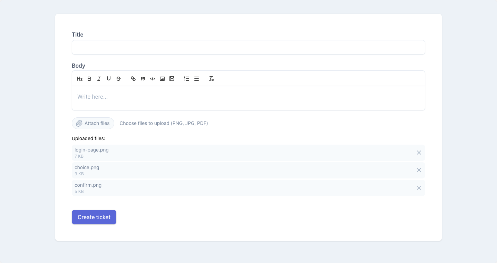

# Uppy Attachment {#uppy-attachment}

Simple File Upload component powered by AlpineJS, Blade Component and Uppy.

[Uppy - Sleek, modular open source JavaScript file uploader](https://uppy.io/).



### Usage

Include the script and style of uppy.

```php
@push('styles')
<link href="https://cdnjs.cloudflare.com/ajax/libs/uppy/1.16.1/uppy.min.css" rel="stylesheet" />

<style>
.uppy-StatusBar {
	background-color: #f7fafc;
}
.uppy-StatusBar:before,
.uppy-StatusBar-progress {
	height: 3px;
}
</style>
@endpush

@push('scripts')
<script src="https://cdnjs.cloudflare.com/ajax/libs/uppy/1.16.1/uppy.min.js"></script>
@endpush
```

> Use `@once` directive available in laravel `v7.25.0` wherever possible. 

```php
// in blade view

<x-uppy-attachment 
	endpoint="{{ route('upload') }}" 
	label="Attach files" 
	name="attachment"
	allowed-files=".jpg,.jpeg,.png,.pdf"
	hint="Choose files to upload (PNG, JPG, PDF)" />
```

> **Note:** No space is allowed in **allowed-files** props.

### Controller

Create an endpoint for upload in routes ```web.php``` file.

```php
Route::post('/uploads', 'UploadController@upload')->name('upload');
```

```php
// app/controllers/UploadController.php

<?php

namespace App\Http\Controllers;

use Illuminate\Http\Request;
use Illuminate\Support\Facades\Storage;

class UploadController extends Controller
{
    public function upload(Request $request)
    {
    	if ($request->file('image')) {

            if (is_array($request->image)) {
                $path = collect($request->image)->map->store('tmp-editor-uploads');
            } else {
                $path = $request->image->store('tmp-editor-uploads');                
            }
    	 
    		return response()->json([
    			'url' => $path
    		], 200);
    	}

    	return;
    }

    public function remove(Request $request)
    {
    	if ($request->has('image')) {
    		$image = $request->image;
    		$exists = Storage::disk('public')->exists($image);
	        if ($exists) {
				Storage::delete($image);
				
				return response()->json('Deleted', 200);
	        }
    	}
    }
}
```

The file is actually "uploaded" to a temporary directory and returning the file name in a hidden input.

```php
<input 
	type="hidden" 
	name="attachments" 
	value="[
		{
			...
		},
		{
			...
		}
	]" 
/>
```

The value of ```name``` field is the name given in component.

### Disable Button on Uploading

```html
<form>
	...

	<x-uppy-attachment 
	    endpoint="{{ route('upload') }}" 
	    label="Attach files" 
	    name="attachment"
	    allowed-files=".jpg,.jpeg,.png,.pdf"
	    hint="Choose files to upload (PNG, JPG, PDF)" />

	<x-button 
		x-data=""
		x-ref="button"
		@uploading.window="
			$event.detail.isUploading === true 
				? $refs.button.disabled = true 
				: $refs.button.disabled = false
		"
		x-cloak
		type="submit" 
		class="shadow bg-indigo-600 text-white">Save Button</x-button>
</form>
```

### Component

```php
// components/uppy-attachment.blade.php

<div
	x-data="{
		uploadedFiles: [],
		errors: [],

		maxFileSize: Number('{{ $maxFileSize ?? 1*1024*1024 }}'),
		maxNumberOfFiles: Number('{{ $maxNumberOfFiles ?? 5 }}'),
		allowedFiles: '{{ $allowedFiles ?? '.jpg,.jpeg,.png,.pdf' }}',

		getFileSize(number) {
			if(number < 1024) {
				return number + ' bytes';
			} else if(number >= 1024 && number < 1048576) {
				return (number/1024).toFixed(0) + ' KB';
			} else if(number >= 1048576) {
				return (number/1048576).toFixed(0) + ' MB';
			}
		}
	}"
	x-init="
		document.addEventListener('DomContentLoaded', () => {
			uppy = Uppy.Core({
				autoProceed: true,
				allowMultipleUploads: true,
				debug: false,
				restrictions: {
					maxFileSize: maxFileSize,
					minFileSize: null,
					maxNumberOfFiles: maxNumberOfFiles,
					minNumberOfFiles: 1,
					allowedFileTypes: allowedFiles.split(',')
				}
			})

			uppy.use(Uppy.StatusBar, {
				target: '.UppyStatusBar',
				hideUploadButton: true,
				showProgressDetails: true,
				hideAfterFinish: true
			})

			uppy.use(Uppy.XHRUpload, {
				endpoint: '{{ $endpoint }}',
				formData: true,
				fieldName: 'image',
				headers: {
					'X-CSRF-TOKEN': '{{ csrf_token() }}',
					'Accept': 'Application/JSON'
				}
			});

			uppy.on('upload', (data) => {
				const evt = new CustomEvent('uploading', { 
					'bubbles': true, 
					detail: {
						'isUploading': true
					}
				});
				window.dispatchEvent(evt);
			})
	
			uppy.on('complete', (result) => {
				// console.log(result.successful);
				const evt = new CustomEvent('uploading', { 
					'bubbles': true, 
					detail: {
						'isUploading': false
					}
				});
				window.dispatchEvent(evt);

				result.successful.map((file) => {
					uploadedFiles.push({
						'url': file.uploadURL,
						'name': file.name,
						'extension': file.extension,
						'size': file.size
					});
				});
			})
				
			$refs.fileInput.addEventListener('change', (event) => {
				const files = Array.from(event.target.files)
				files.forEach((file) => {
					try {
						uppy.addFile({
							source: 'file input',
							name: file.name,
							type: file.type,
							data: file
						})
					} catch (err) {
						errors = [];

						if (file.size > maxFileSize) {
							errors.push(`File name <strong>${file.name}</strong> exceeds maximum allowed size of ${getFileSize(maxFileSize)}`);
						} 

						if (! allowedFiles.includes(file.type)) {
							errors.push(`File format of <strong>${file.name}</strong> is invalid.`);
						}

						//console.log(err);
						//if (err.isRestriction) {
							// errors.push(err);
							// handle restrictions
							//console.log('Restriction error:', err)
						//} else {
							// handle other errors
							//console.error(err)
						//}
					}
				})
			})
		});
	">

 	<input type="hidden" :value="JSON.stringify(uploadedFiles)" name="{{ $name ?? '' }}" />
	<input 
		:accept="allowedFiles"
		type="file" 
		x-ref="fileInput" 
		class="hidden" 
		multiple />
	
	<div class="flex flex-col md:flex-row md:items-center">
		<button
			x-on:click="$refs.fileInput.click()" 
			type="button" 
			class="text-sm inline-flex items-center border bg-gray-100 rounded-full focus:rounded-full pl-2 pr-3 py-1 text-gray-600">
			<svg class="text-gray-500 w-6 h-6 mr-1" fill="none" stroke-linecap="round" stroke-linejoin="round" stroke-width="2" viewBox="0 0 24 24" stroke="currentColor"><path d="M15.172 7l-6.586 6.586a2 2 0 102.828 2.828l6.414-6.586a4 4 0 00-5.656-5.656l-6.415 6.585a6 6 0 108.486 8.486L20.5 13"></path></svg>
			{{ $label ?? 'Choose files' }}
		</button>	
		
		@isset($hint)
			<div class="text-sm text-gray-600 md:ml-4 leading-tight help-text">{{ $hint }}</div>
		@endisset
	</div>
	
	<div x-show="errors.length > 0" class="mt-2">
		<template x-for="(error, index) in errors" :key="index">
			<div x-html="error" class="text-red-600 text-sm"></div>
		</template>	
	</div>
	
	<div class="UppyStatusBar mt-2"></div>
	 
	<!-- Uploaded files list -->
	<div class="uploaded-files mt-2 mb-5" x-show="uploadedFiles.length > 0">
		<h5 class="mb-2 text-sm">Uploaded files:</h5>
		<template x-for="(file, index) in uploadedFiles" :key="index">
			<div>
				<div class="bg-gray-100 mb-1 rounded-lg px-2 p-1 flex items-center">
					<div class="flex-1">
						<div x-text="file.name" class="text-sm text-gray-600"></div>
						<div x-text="getFileSize(file.size)" class="text-xs text-gray-500"></div>
					</div>
					<div class="p-1 w-6 cursor-pointer text-gray-600 hover:text-gray-700" x-on:click="uploadedFiles.splice(index, 1)">
						<svg class="w-5 h-5 text-gray-500 hover:text-gray-700" fill="none" viewBox="0 0 24 24" stroke="currentColor"><path stroke-linecap="round" stroke-linejoin="round" stroke-width="2" d="M6 18L18 6M6 6l12 12"></path></svg>
					</div>
				</div>
			</div>
		</template>
	</div>
</div>
```
